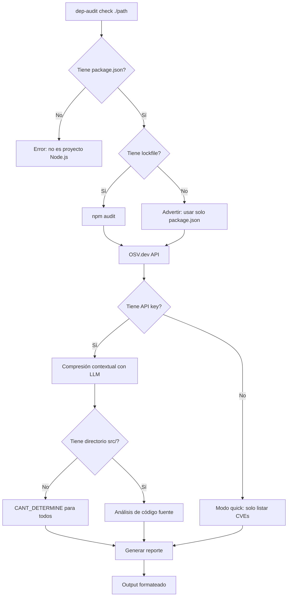

# Technical Design Document — AI Dependency Auditor

## 1. Resumen Ejecutivo

**AI Dependency Auditor** es una herramienta CLI que audita vulnerabilidades en
dependencias de npm utilizando inteligencia artificial para reducir falsos
positivos. A diferencia de herramientas tradicionales como `npm audit` (que
listan todas las vulnerabilidades potenciales sin contexto), esta herramienta
usa LLMs para analizar si las vulnerabilidades realmente afectan al código del
proyecto.

### Problema

`npm audit` y herramientas similares reportan vulnerabilidades basadas en la
versión de la dependencia, no en su uso real. Esto genera:

- **Falsos positivos:** ~70% de los CVEs reportados no aplican al proyecto
  específico
- **Ruido:** El desarrollador debe investigar manualmente cada CVE
- **Fatiga de alertas:** Con el tiempo, los equipos ignoran las alertas de
  seguridad

### Solución

Una herramienta que combina:
1. Escaneo tradicional (npm audit + OSV.dev API)
2. Compresión contextual con LLM (filtra CVEs irrelevantes)
3. Análisis de código fuente (detecta uso real de funciones vulnerables)
4. Agente inteligente (decide el flujo según el contexto)

## 2. Stack Tecnológico

| Componente | Tecnología | Justificación |
|---|---|---|
| Lenguaje | TypeScript (ES2022) | Tipado estricto, ecosistema npm, inferencia de tipos |
| Runtime | Node.js 20+ | LTS, soporte nativo ESM, fetch global |
| CLI | Commander.js | Estándar en la comunidad Node.js, tipado con generics |
| LLM | OpenAI SDK (compatible multi-provider) | Misma interfaz para OpenAI, Ollama, Groq, Azure; SDKs nativos para Anthropic y Gemini |
| Validación | Zod | Schemas en runtime para output del LLM, config |
| Output | Picocolors | Colores en terminal sin dependencias pesadas |
| Testing | Vitest | Rápido, compatible con ESM nativo, mocking integrado |
| Build | tsup | Empaquetado en ESM, tree-shaking, dts generation |

## 3. Arquitectura

### 3.1 Diagrama de Componentes

```
┌─────────────────────────────────────────────────────────────┐
│                        CLI Layer                            │
│  src/cli.ts (Commander)                                     │
│  - Parsea flags y argumentos                                │
│  - Resuelve configuración                                   │
│  - Invoca al agente                                         │
│  - Formatea output                                          │
└─────────────────────────┬───────────────────────────────────┘
                          │
┌─────────────────────────▼───────────────────────────────────┐
│                     Config Layer                             │
│  src/config/                                                 │
│  - index.ts: Resolvedor central (flags > env > file)        │
│  - providers.ts: Defaults para 6 providers                   │
│  - env.ts: Lectura de variables de entorno                   │
│  - config-file.ts: ~/.dep-audit/config.json                  │
└─────────────────────────┬───────────────────────────────────┘
                          │
┌─────────────────────────▼───────────────────────────────────┐
│                    Agent Layer                               │
│  src/agent/                                                  │
│  - orchestrator.ts: Orquestador del flujo                    │
│  - tools.ts: Herramientas disponibles                        │
│    (scan, compress, analyze, report)                         │
└─────────────────────────┬───────────────────────────────────┘
          │                │                  │
          ▼                ▼                  ▼
┌──────────────┐  ┌──────────────┐  ┌──────────────────┐
│   Scanner    │  │    LLM      │  │    Analysis       │
│  src/scanner/│  │  src/llm/   │  │  src/analysis/    │
│              │  │             │  │                   │
│ • parser.ts  │  │ • openai    │  │ • compressor.ts   │
│ • npm-audit  │  │ • anthropic │  │ • source-analyzer │
│ • osv-api.ts │  │ • gemini    │  │                   │
│              │  │ • prompts   │  └──────────────────┘
└──────────────┘  └──────────────┘
       │                 │
       ▼                 ▼
┌──────────────────────────────────────────────────┐
│                Output Layer                       │
│  src/output/                                      │
│  - json.ts: JSON estructurado                     │
│  - table.ts: Tabla coloreada                      │
│  - summary.ts: Resumen ejecutivo                  │
└──────────────────────────────────────────────────┘
```

### 3.2 Flujo de Datos

```
Usuario ejecuta: dep-audit check ./path --mode full

1. CLI parsea flags → Config
2. Agente evalúa entorno:
   ├─ ¿package.json? → parsear
   ├─ ¿lockfile? → npm audit | fallback OSV.dev
   ├─ ¿API key? → modo full | modo quick
   └─ ¿src/? → source analysis | CANT_DETERMINE
3. Scanner recolecta CVEs (npm audit + OSV.dev)
4. Compressor filtra CVEs con LLM
5. Source-analyzer revisa código fuente
6. Orquestador genera reporte con clasificaciones
7. Formatter produce output según formato elegido
8. Exit code: 0 (seguro) | 1 (vulnerabilidades reales)
```

### 3.3 Flujo de Decisión del Agente



## 4. Decisiones de Diseño

### 4.1 Arquitectura Multi-Provider

**Decisión:** Usar el SDK de OpenAI como interfaz base con adaptadores para
Anthropic y Gemini.

**Razón:** El SDK de OpenAI ya es compatible con Ollama, Groq y Azure (misma
API REST). Para Anthropic y Gemini, se usan SDKs nativos con carga dinámica
para no aumentar el peso de instalación.

**Alternativa considerada:** Usar LangChain como abstracción unificada.
Descartado porque agrega complejidad innecesaria para este caso de uso.

### 4.2 Compresión Contextual como Técnica Avanzada

**Decisión:** Implementar "Contextual Compression" como la técnica avanzada
requerida por la rúbrica.

**Razón:** La técnica reduce el volumen de datos que pasa al LLM, ahorrando
tokens (~40-60%) y mejorando la precisión del análisis. El compressor toma
todos los CVEs y extrae solo: `{cve_id, severity, vulnerable_function,
fix_version}`, eliminando CVEs irrelevantes.

**Métrica de éxito:** Reducción de al menos 50% en tokens de entrada.

### 4.3 Estrategia de Retry y Backoff

**Decisión:** Implementar retry exponencial con jitter para errores
transitorios (429, 5xx). No reintentar errores de autenticación (401, 403).

**Parámetros:**
- Base delay: 1s
- Max delay: 30s
- Max attempts: 3
- Jitter: aleatorio ±10%
- No retry: 401, 403, timeouts

### 4.4 Cache Local

**Decisión:** Cache en archivo JSON plano en `~/.dep-audit/cache/` con TTL
configurable (default 24h).

**Razón:** Los datos de OSV.dev cambian lentamente. Cachear evita llamadas
repetidas a la API, reduce latencia y permite modo offline.

### 4.5 Manejo de Paquetes Privados

**Decisión:** Heurística basada en scope (`@org/xxx`). Los paquetes con scope
no estándar se marcan como `NONE` con nota de verificación manual.

**Excepciones conocidas:** `@angular/`, `@types/`, `@babel/`, `@nestjs/`,
`@vue/`, `@testing-library/` son paquetes públicos conocidos.

### 4.6 Formato de Reporte

**Decisión:** Los reportes usan una estructura plana con tipos inmutables
(`readonly` en interfaces). Tres formatos de output: JSON (para CI/CD), tabla
coloreada (terminal), resumen (una línea).

## 5. Componentes Principales

### 5.1 Scanner (`src/scanner/`)

| Archivo | Responsabilidad |
|---|---|
| `parser.ts` | Parsear package.json, detectar lockfile, `detectMultipleLockfiles()` |
| `npm-audit.ts` | Ejecutar `npm audit --json` y parsear resultado |
| `osv-api.ts` | Cliente HTTP para OSV.dev API, `isPrivatePackage()`, `isWithdrawn()` |
| `index.ts` | Orquestar fuentes, unificar resultados |

### 5.2 LLM Clients (`src/llm/`)

| Archivo | Responsabilidad |
|---|---|
| `index.ts` | Factory: crear cliente según provider |
| `openai-client.ts` | Cliente OpenAI (compatible con Ollama, Groq, Azure) |
| `anthropic-client.ts` | Cliente Anthropic (SDK nativo, carga dinámica) |
| `gemini-client.ts` | Cliente Gemini (SDK nativo, carga dinámica) |
| `prompts.ts` | Prompts del sistema, `INJECTION_GUARD` |

### 5.3 Analysis (`src/analysis/`)

| Archivo | Responsabilidad |
|---|---|
| `compressor.ts` | Compresión contextual de CVEs, batch processing |
| `source-analyzer.ts` | Análisis de funciones vulnerables en código fuente |
| `index.ts` | Orquestar análisis |

### 5.4 Agente (`src/agent/`)

| Archivo | Responsabilidad |
|---|---|
| `index.ts` | Entry point del agente |
| `orchestrator.ts` | Flujo principal: scan → compress → analyze → report |
| `tools.ts` | Herramientas: `checkEnvironment()` |

### 5.5 Output (`src/output/`)

| Archivo | Responsabilidad |
|---|---|
| `json.ts` | Formato JSON estructurado |
| `table.ts` | Tabla coloreada con picocolors |
| `summary.ts` | Resumen ejecutivo en una línea |

## 6. Modelo de Datos

### 6.1 Dependency

```typescript
interface Dependency {
  readonly name: string;      // "lodash"
  readonly version: string;   // "4.17.20"
  readonly type: "prod" | "dev" | "optional" | "peer";
}
```

### 6.2 Advisory

```typescript
interface Advisory {
  readonly id: string;                    // "GHSA-xxxx-xxxx-xxxx"
  readonly cveId: string | null;          // "CVE-2021-23337"
  readonly packageName: string;           // "lodash"
  readonly severity: Severity;            // "CRITICAL" | "HIGH" | ...
  readonly title: string;                 // Descripción corta
  readonly fixVersion: string | null;     // "4.17.21"
  readonly vulnerableFunctions: string[]; // ["template"]
  readonly withdrawn: boolean;            // Retirado de OSV
}
```

### 6.3 AnalysisResult

```typescript
interface AnalysisResult {
  readonly dependency: {
    readonly name: string;
    readonly version: string;
    readonly type: "prod" | "dev" | "optional" | "peer";
  };
  readonly advisory: {
    readonly id: string;
    readonly cveId: string | null;
    readonly severity: Severity;
    readonly title: string;
    readonly fixVersion: string | null;
  };
  readonly usage: "USED" | "NOT_USED" | "CANT_DETERMINE";
  readonly usageEvidence: readonly string[];
  readonly risk: "CRITICAL" | "HIGH" | "MEDIUM" | "LOW" | "NONE";
  readonly confidence: number; // 0.0 - 1.0
}
```

## 7. Edge Cases y Robustez

| # | Escenario | Comportamiento |
|---|---|---|
| 1 | `package.json` sin dependencias | Reporte vacío, exit code 0 |
| 2 | Lockfile corrupto (JSON inválido) | Try/catch, fallback a solo package.json |
| 3 | Múltiples lockfiles | Advertir, usar el primero encontrado |
| 4 | Timeout en OSV.dev | AbortError, mensaje descriptivo, continuar |
| 5 | Rate limit en OSV.dev | Retry con backoff exponencial + jitter |
| 6 | Paquete privado (`@company/xxx`) | Advisory NONE + verificación manual |
| 7 | Paquete retirado de OSV | Filtrar, no incluir en reporte |
| 8 | Sin directorio `src/` | Skip source analysis, todos CANT_DETERMINE |
| 9 | 50+ CVEs | Batch processing en grupos de 20 |
| 10 | Error del LLM (timeout, rate limit) | Retry 3 veces con backoff |
| 11 | Prompt injection en datos de CVE | Guard en system prompt |
| 12 | Sin API key | Modo quick audit automático |

## 8. Pruebas

### 8.1 Estrategia

- **Unit tests:** Cada módulo con mocking de dependencias externas
- **Integration tests:** Flujo completo con datos reales (pero mockeando APIs)
- **Edge case tests:** Escenarios específicos de la tabla anterior

### 8.2 Cobertura

| Módulo | Archivos de test | Tests |
|---|---|---|
| Scanner | `parser.test.ts`, `npm-audit.test.ts`, `osv-api.test.ts` | ~30 |
| LLM | `openai-client.test.ts`, `prompts.test.ts` | ~20 |
| Analysis | `compressor.test.ts`, `source-analyzer.test.ts` | ~25 |
| Agent | `orchestrator.test.ts` | ~20 |
| Output | `json.test.ts`, `table.test.ts` | ~15 |
| Cache | `file-cache.test.ts` | ~10 |
| Integration | `integration.test.ts` | ~19 |
| **Total** | | **~139** |

## 9. Seguridad

### 9.1 API Keys

- Las API keys se leen de: flags CLI, archivo de configuración, variables de
  entorno (en ese orden de precedencia)
- Los logs sanitizan las API keys automáticamente
- El archivo de configuración `~/.dep-audit/config.json` está en `.gitignore`

### 9.2 Prompt Injection

- Todos los prompts del sistema incluyen un `INJECTION_GUARD` que trata los
  datos como no confiables
- Los datos de CVEs son JSON estructurado de APIs confiables (npm audit, OSV.dev)
- No se ejecuta código basado en output del LLM

### 9.3 Dependencias

- Solo 4 dependencias de producción (`openai`, `commander`, `zod`, `picocolors`)
- SDKs de Anthropic y Gemini se cargan dinámicamente (solo si se usan)

## 10. Monitoreo y Trazas

### 10.1 Logger Estructurado

```typescript
logger.info({ event: "scan.start", path });
logger.warn({ event: "no-lockfile", path, fallback: "package.json" });
logger.error({ event: "api-rate-limited", provider: "OSV.dev", retryIn: 30 });
```

### 10.2 Trazas

- Cada corrida genera un archivo de trace en `~/.dep-audit/traces/`
- Contiene: input, output, tokens usados, duración, steps
- Integración opcional con LangSmith

## 11. Referencias

- [OSV.dev API Documentation](https://osv.dev/docs/)
- [OpenAI SDK Documentation](https://github.com/openai/openai-node)
- [npm audit Documentation](https://docs.npmjs.com/cli/v10/commands/npm-audit)
- [Commander.js](https://github.com/tj/commander.js)
- [Zod Documentation](https://zod.dev/)
