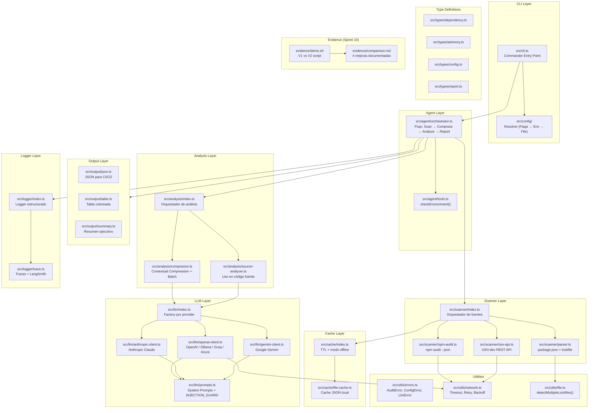
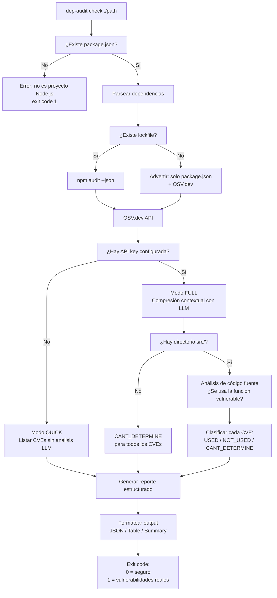
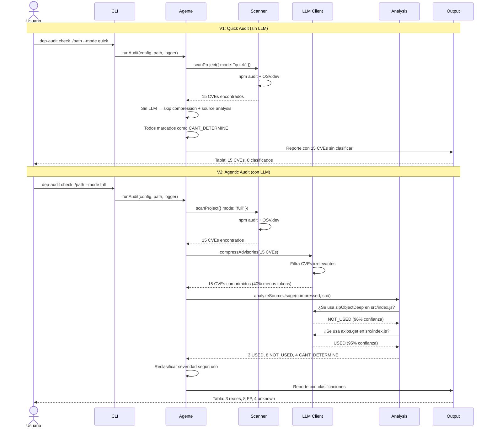
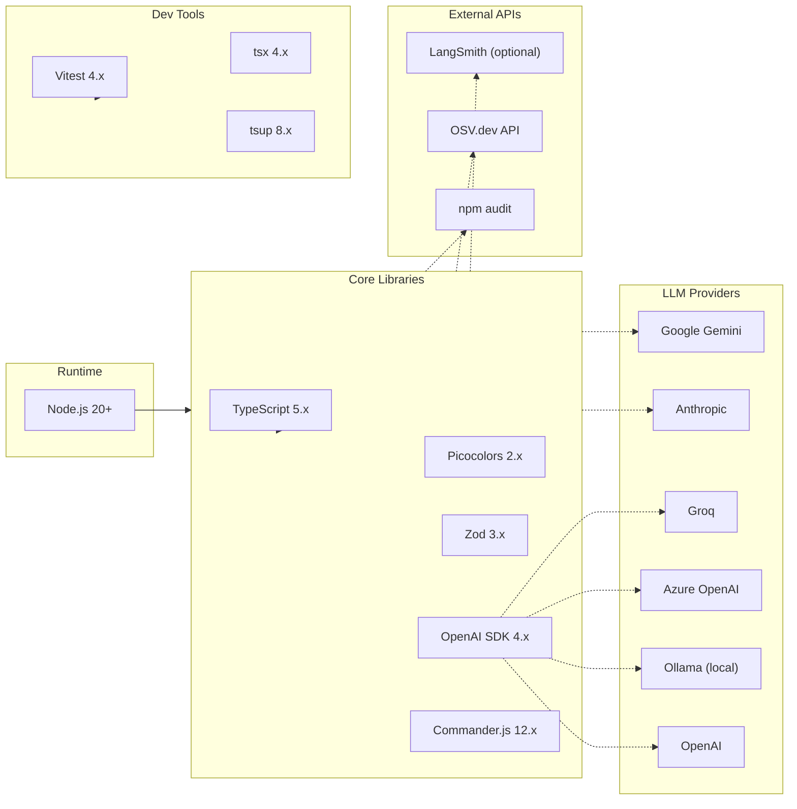

# Architecture Diagram — AI Dependency Auditor

## Diagrama de Arquitectura

```mermaid
flowchart TB
    subgraph CLI["CLI Layer"]
        CLI_Entry["src/cli.ts<br/>Commander Entry Point"]
        Config["src/config/<br/>Resolver (Flags → Env → File)"]
    end

    subgraph Agent["Agent Layer"]
        Orchestrator["src/agent/orchestrator.ts<br/>Flujo: Scan → Compress → Analyze → Report"]
        Tools["src/agent/tools.ts<br/>checkEnvironment()"]
    end

    subgraph Scanner["Scanner Layer"]
        Parser["src/scanner/parser.ts<br/>package.json + lockfile"]
        NpmAudit["src/scanner/npm-audit.ts<br/>npm audit --json"]
        OsvApi["src/scanner/osv-api.ts<br/>OSV.dev REST API"]
        ScanIndex["src/scanner/index.ts<br/>Orquestador de fuentes"]
    end

    subgraph LLM["LLM Layer"]
        LlmFactory["src/llm/index.ts<br/>Factory por provider"]
        OpenAIClient["src/llm/openai-client.ts<br/>OpenAI / Ollama / Groq / Azure"]
        AnthropicClient["src/llm/anthropic-client.ts<br/>Anthropic Claude"]
        GeminiClient["src/llm/gemini-client.ts<br/>Google Gemini"]
        Prompts["src/llm/prompts.ts<br/>System Prompts + INJECTION_GUARD"]
    end

    subgraph Analysis["Analysis Layer"]
        Compressor["src/analysis/compressor.ts<br/>Contextual Compression + Batch"]
        SourceAnalyzer["src/analysis/source-analyzer.ts<br/>Uso en código fuente"]
        AnalysisIndex["src/analysis/index.ts<br/>Orquestador de análisis"]
    end

    subgraph Output["Output Layer"]
        JsonOutput["src/output/json.ts<br/>JSON para CI/CD"]
        TableOutput["src/output/table.ts<br/>Tabla coloreada"]
        SummaryOutput["src/output/summary.ts<br/>Resumen ejecutivo"]
    end

    subgraph Cache["Cache Layer"]
        FileCache["src/cache/file-cache.ts<br/>Cache JSON local"]
        CacheIndex["src/cache/index.ts<br/>TTL + modo offline"]
    end

    subgraph Logger["Logger Layer"]
        LoggerModule["src/logger/index.ts<br/>Logger estructurado"]
        TraceModule["src/logger/trace.ts<br/>Trazas + LangSmith"]
    end

    subgraph Types["Type Definitions"]
        DependencyTypes["src/types/dependency.ts"]
        AdvisoryTypes["src/types/advisory.ts"]
        ConfigTypes["src/types/config.ts"]
        ReportTypes["src/types/report.ts"]
    end

    subgraph Utils["Utilities"]
        Errors["src/utils/errors.ts<br/>AuditError, ConfigError, LlmError"]
        Network["src/utils/network.ts<br/>Timeout, Retry, Backoff"]
        FileUtils["src/utils/file.ts<br/>detectMultipleLockfiles()"]
    end

    subgraph Evidence["Evidence (Sprint 10)"]
        DemoScript["evidence/demo.sh<br/>V1 vs V2 script"]
        Comparison["evidence/comparison.md<br/>4 mejoras documentadas"]
    end

    %% Connections
    CLI_Entry --> Config
    CLI_Entry --> Orchestrator
    Orchestrator --> Tools
    Orchestrator --> ScanIndex
    Orchestrator --> AnalysisIndex
    Orchestrator --> Output
    Orchestrator --> LoggerModule

    ScanIndex --> Parser
    ScanIndex --> NpmAudit
    ScanIndex --> OsvApi
    ScanIndex --> CacheIndex
    CacheIndex --> FileCache

    AnalysisIndex --> Compressor
    AnalysisIndex --> SourceAnalyzer
    Compressor --> LlmFactory
    SourceAnalyzer --> LlmFactory

    LlmFactory --> OpenAIClient
    LlmFactory --> AnthropicClient
    LlmFactory --> GeminiClient
    OpenAIClient --> Prompts
    AnthropicClient --> Prompts
    GeminiClient --> Prompts

    Parser --> FileUtils
    NpmAudit --> Network
    OsvApi --> Network
    OpenAIClient --> Network

    LoggerModule --> TraceModule

    %% Evidence
    DemoScript --> Comparison
```

## Diagrama de Flujo de Decisión del Agente

```mermaid
flowchart TD
    A["dep-audit check ./path"] --> B["¿Existe package.json?"]
    B -->|No| C["Error: no es proyecto Node.js<br/>exit code 1"]
    B -->|Sí| D["Parsear dependencias"]

    D --> E["¿Existe lockfile?"]
    E -->|Sí| F["npm audit --json"]
    E -->|No| G["Advertir: solo package.json<br/> + OSV.dev"]
    F --> H["OSV.dev API"]
    G --> H

    H --> I["¿Hay API key configurada?"]
    I -->|No| J["Modo QUICK<br/>Listar CVEs sin análisis LLM"]
    I -->|Sí| K["Modo FULL<br/>Compresión contextual con LLM"]

    K --> L["¿Hay directorio src/?"]
    L -->|No| M["CANT_DETERMINE<br/>para todos los CVEs"]
    L -->|Sí| N["Análisis de código fuente<br/>¿Se usa la función vulnerable?"]

    N --> O["Clasificar cada CVE:<br/>USED / NOT_USED / CANT_DETERMINE"]

    J --> P["Generar reporte estructurado"]
    M --> P
    O --> P

    P --> Q["Formatear output<br/>JSON / Table / Summary"]
    Q --> R["Exit code:<br/>0 = seguro<br/>1 = vulnerabilidades reales"]
```

## Flujo de Datos V1 vs V2

```mermaid
sequenceDiagram
    actor User as Usuario
    participant CLI as CLI
    participant Agent as Agente
    participant Scanner as Scanner
    participant LLM as LLM Client
    participant Analysis as Analysis
    participant Output as Output

    Note over User,Output: V1: Quick Audit (sin LLM)

    User->>CLI: dep-audit check ./path --mode quick
    CLI->>Agent: runAudit(config, path, logger)
    Agent->>Scanner: scanProject({ mode: "quick" })
    Scanner->>Scanner: npm audit + OSV.dev
    Scanner-->>Agent: 15 CVEs encontrados
    Agent->>Agent: Sin LLM → skip compression + source analysis
    Agent->>Agent: Todos marcados como CANT_DETERMINE
    Agent->>Output: Reporte con 15 CVEs sin clasificar
    Output-->>User: Tabla: 15 CVEs, 0 clasificados

    Note over User,Output: V2: Agentic Audit (con LLM)

    User->>CLI: dep-audit check ./path --mode full
    CLI->>Agent: runAudit(config, path, logger)
    Agent->>Scanner: scanProject({ mode: "full" })
    Scanner->>Scanner: npm audit + OSV.dev
    Scanner-->>Agent: 15 CVEs encontrados

    Agent->>LLM: compressAdvisories(15 CVEs)
    LLM->>LLM: Filtra CVEs irrelevantes
    LLM-->>Agent: 15 CVEs comprimidos (40% menos tokens)

    Agent->>Analysis: analyzeSourceUsage(compressed, src/)
    Analysis->>LLM: ¿Se usa zipObjectDeep en src/index.js?
    LLM-->>Analysis: NOT_USED (96% confianza)
    Analysis->>LLM: ¿Se usa axios.get en src/index.js?
    LLM-->>Analysis: USED (95% confianza)
    Analysis-->>Agent: 3 USED, 8 NOT_USED, 4 CANT_DETERMINE

    Agent->>Agent: Reclasificar severidad según uso
    Agent->>Output: Reporte con clasificaciones
    Output-->>User: Tabla: 3 reales, 8 FP, 4 unknown
```

## Stack Diagrama

```mermaid
graph LR
    subgraph Runtime["Runtime"]
        Node["Node.js 20+"]
    end

    subgraph Core["Core Libraries"]
        TS["TypeScript 5.x"]
        Commander["Commander.js 12.x"]
        OpenAI["OpenAI SDK 4.x"]
        Zod["Zod 3.x"]
        Picocolors["Picocolors 2.x"]
    end

    subgraph Dev["Dev Tools"]
        Vitest["Vitest 4.x"]
        Tsup["tsup 8.x"]
        Tsx["tsx 4.x"]
    end

    subgraph External["External APIs"]
        NPM["npm audit"]
        OSV["OSV.dev API"]
        LangSmith["LangSmith (optional)"]
    end

    subgraph LLMProviders["LLM Providers"]
        OpenAI_Provider["OpenAI"]
        Anthropic["Anthropic"]
        Gemini["Google Gemini"]
        Ollama["Ollama (local)"]
        Azure["Azure OpenAI"]
        Groq["Groq"]
    end

    Node --> Core
    Core --> TS
    Core --> Commander
    Core --> OpenAI
    Core --> Zod
    Core --> Picocolors
    Dev --> Vitest
    Dev --> Tsup
    Dev --> Tsx

    OpenAI -.-> OpenAI_Provider
    OpenAI -.-> Ollama
    OpenAI -.-> Azure
    OpenAI -.-> Groq
    Core -.-> Anthropic
    Core -.-> Gemini
    Core -.-> NPM
    Core -.-> OSV
    Core -.-> LangSmith
```
